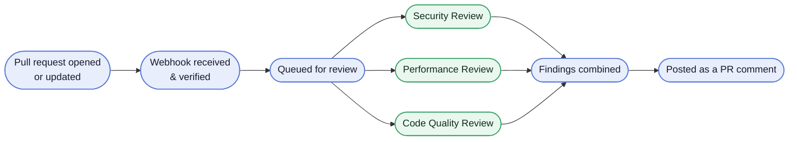

# Autonomous Code Review Engine

[](https://github.com/SomeoneSomewhereelse/pr-review-bot/actions/workflows/ci.yml)


Open a pull request, and this bot reviews it automatically — checking for
security risks, performance issues, and code-quality problems — then posts
the results as a single comment on the PR itself. Three specialists run in
parallel, each backed by an LLM call with structured output, and later pushes
edit that same comment in place rather than piling up new ones.

**[Deploy your own →](https://someonesomewhereelse.github.io/pr-review-bot/setup/)**
— the full setup guide, from a fresh clone to a first posted review comment,
covering both a local run and a hosted Render + Supabase deployment. The same
pages live in [`guide/`](guide/setup/index.md) if you would rather read them
in the repo.

Full design: [`SPEC.md`](SPEC.md). Stack/conventions: [`CLAUDE.md`](CLAUDE.md).
Cost model: [`cost.md`](cost.md). This project's actual live configuration
differs from `SPEC.md`'s defaults in a few documented ways — see "Known
limitations" below.

## How it works



<details>
<summary><strong>Implementation detail</strong></summary>

- The webhook handler reads the **raw body**, verifies the HMAC-SHA256
  signature in constant time, and returns `401` if it doesn't match.
- Each delivery is deduplicated on GitHub's `X-GitHub-Delivery` header — a
  replayed delivery gets a `200` no-op instead of a second review.
- A valid delivery becomes a durable ticket in Postgres and the webhook
  returns `202` immediately — no LLM work ever happens in the request path.
- A single background dispatcher (started with the app) is the only thing
  that drains the queue, one ticket at a time, in FIFO order (honoring a
  deferred ticket's `not_before`).
- For each ticket: authenticate as the GitHub App, fetch the PR diff,
  annotate it with `file:line` and cap it to a token budget, then run all
  three specialists concurrently (`asyncio.gather`).
- If a provider returns a rate limit (`429`), the bot posts (or keeps) a
  placeholder comment and reschedules the ticket automatically — this
  survives a restart.
- Otherwise, results (successes *and* failures) are merged with timing and
  cost data into a single Markdown comment, which is found-or-created on the
  PR and edited in place on every later push.

See [`SPEC.md` §12](SPEC.md#12-review-queue-rpm--daily-quota-handling) for
the full queue design (ticket store, in-memory rate gate, restart recovery).
</details>

## What a review looks like

A real posted comment, condensed to one finding per specialist:

```markdown
## 🤖 Automated Code Review — PR #42
_3 specialists · llama-3.3-70b-versatile (groq) · 4.2s · ~$0.0021_

### 🔒 Security — 1 finding
| Severity | Line | Issue | Suggested fix |
| --- | --- | --- | --- |
| 🔴 critical | `app/auth.py:88` | API key is logged in plaintext when the request fails | Log only the key's length/hash, never the raw value |

### ⚡ Performance — 1 finding
| Impact | Line | Issue | Suggestion |
| --- | --- | --- | --- |
| 🟡 medium | `app/api/users.py:145` | N+1 | Batch these lookups into a single query |

### 🧹 Code Quality — 1 finding
| Category | Line | Issue | Refactoring suggestion |
| --- | --- | --- | --- |
| duplication | `app/utils/format.py:22` | Date-formatting logic is duplicated across three modules | Extract a shared helper |

---
<sub>Runtime 4.2s · 1,842 tok in / 612 tok out · est. $0.0021 · provider: groq</sub>
```

If a specialist's own check fails outright, its section says so plainly
instead of vanishing — partial failure is always visible, never silent.

## Tech stack

FastAPI (async) · `uv` · PyGitHub (GitHub App auth) · `google-genai` +
`groq` behind a swappable `LLMProvider` seam · Pydantic v2 validate-repair ·
`pytest`/`pytest-asyncio`/`respx` · Docker · Render + Supabase Postgres.

## Running locally

```bash
uv sync
cp .env.example .env   # fill in real values — see the guide's setup section
uv run uvicorn app.main:app --host 0.0.0.0 --port 8000
```

- `GET /healthz` → `200`
- `POST /webhook` → `401` (bad/missing signature), `200` (replayed delivery),
  or `202` (accepted, review runs in the background)
- `GET /` → the live ops/demo dashboard — light/dark/system theme,
  English/Hebrew with RTL, auto-refreshing review history and queue stats
- `GET /api/dashboard` → JSON backing endpoint for the dashboard above

### Docker

```bash
docker build -t pr-review-engine .
docker run -p 8000:8000 --env-file .env pr-review-engine
```

## Testing

```bash
uv run ruff check .
uv run pytest -v
```

856 deterministic tests, no real network calls — every GitHub, LLM-provider,
and webhook interaction is mocked. CI (`.github/workflows/ci.yml` at the repo
root) runs `ruff` + `pytest` on every push/PR touching this project.

<details>
<summary>Local test setup and performance notes</summary>

**Prerequisite:** the queue store runs on Postgres, so DB-touching tests need
either Docker installed locally (`tests/conftest.py`'s `db_url` fixture spins
up a throwaway Postgres 16 via `testcontainers` automatically) or a
`DATABASE_URL` env var pointing at a reachable local Postgres. Without either,
those tests fail with an opaque testcontainers error. CI provides this
automatically via a `services: postgres` container — no action needed there.

**Faster local iteration:** `eval "$(uv run python -m scripts.test_db)"` once
per shell session starts a persistent local test Postgres and exports
`DATABASE_URL`, so `pytest` skips testcontainers' cold boot; `uv run python -m
scripts.test_db down` tears it down. That shell now has a throwaway
`DATABASE_URL` exported, which takes priority over `.env` — `unset
DATABASE_URL` (or use a fresh shell) before any deploy tooling;
`scripts/deploy.py --sync-env` refuses outright rather than pushing a
localhost database to the live service.

Run `pytest -m "not db and not xdist_meta"` to skip Postgres-touching tests
and this suite's own slow xdist-scheduling meta-test for the fastest inner
loop; CI still runs the full suite. Tests run in parallel on a **fixed 4
workers** (`pyproject.toml`'s `addopts`), deliberately not `-n auto` — one
worker per core is a net loss on a suite this size, since each pays a full
app-import startup cost. Add `-n0` to disable parallelism for interactive
debugging (`--pdb`, `-s`), which xdist workers cannot forward.
</details>

### Live verification scripts

These make real network calls against real accounts/services — not run by
CI. Each is self-contained and prints what it's proving:

| Script | Proves |
|---|---|
| `scripts/manual_verify_step3.py` | GitHub App auth, diff fetch, comment upsert (edit-in-place) against a real PR |
| `scripts/manual_verify_step4.py` | Gemini provider through the validate-repair layer |
| `scripts/manual_verify_groq.py` | Groq provider through the validate-repair layer |
| `scripts/manual_verify_vertex.py` | Vertex AI provider (service-account or ADC) through the validate-repair layer |
| `scripts/seed_demo_pr.py` | Opens a real PR with planted issues (`fixtures/bad_code/`) on the test repo |
| `scripts/demo_provider_swap.py` | `LLM_PROVIDER` is a genuine runtime seam — see below for this script's current expected behavior |

A real, repeated end-to-end rehearsal of this project — through the actual
GitHub webhook path, both locally and hosted — is logged in the guide's
[Live rehearsal history](guide/background/rehearsals.md).

## Known limitations

This project deliberately deviates from `SPEC.md`'s defaults in a few
documented ways — most notably, **Groq is the primary live provider**
(pulled forward from a later build step to have a working live path from
early on), with Gemini and Vertex AI both also live and verified. The review
queue is single-process only (no horizontal scaling yet).

<details>
<summary>Full list of deviations</summary>

- **Vertex AI**: live and fully verified (`LLM_PROVIDER=vertex`), reinstated
  2026-08-14 — it had been removed while this project's no-card constraint
  made it unrunnable, and came back once GCP billing/ADC access became
  available. Unlike the other two providers its credential is a GCP
  service-account identity: `GCP_SERVICE_ACCOUNT_KEY` (hosted, base64) →
  implicit ADC. Two bugs were found and fixed via real live calls
  before it succeeded (see the guide's [Provider history](guide/background/providers.md)
  for the full history): a missing OAuth scope on the service-account
  credential path, and the shared `LLM_MODEL` default (`gemini-flash-latest`)
  not existing as a Vertex publisher model for this project — Vertex's
  catalog only carries the 2.5 generation here
  (`gemini-2.5-flash`/`gemini-2.5-flash-lite`), not the AI-Studio alias.
  **Confirmed live**: with the model set to `gemini-2.5-flash`, a real call
  through `scripts/manual_verify_vertex.py` against real Vertex AI returned a
  valid structured-output response with non-zero token usage. Vertex now owns
  its own model var, `VERTEX_MODEL` (default `gemini-2.5-flash`, the
  confirmed-working value) — sharing `LLM_MODEL` with gemini made a DB
  provider flip to vertex guaranteed-broken, since gemini's default 404s on
  Vertex's catalog. Operators only need to override `VERTEX_MODEL` if their
  own project's Vertex publisher-model catalog differs.
- **Gemini (AI-Studio)**: live and working (`LLM_PROVIDER=gemini`) — re-verified
  2026-08-10 via `scripts/manual_verify_step4.py` (real structured output,
  non-zero token usage). See the guide's [Provider history](guide/background/providers.md)
  for the account-access history this project worked through earlier.
  `scripts/demo_provider_swap.py`'s description of a graceful Gemini failure
  predates this and hasn't been re-run against the current key.
- **Groq is the primary live provider** (`LLM_PROVIDER=groq`,
  `llama-3.3-70b-versatile`) — pulled forward from a later build step
  specifically to have a working live path.
- **Docker**: fully verified (`docker build` + container boot + endpoint
  checks) — installed partway through development, not from the start.
- **Durable review queue is single-process** (see `SPEC.md` §12) — one
  dispatcher, no horizontal scaling. The atomic ticket claim would make a
  multi-instance deployment possible later, but it is neither built for nor
  tested.
- **`blocked_until` is in-memory, not durable.** It's re-learned from the
  first honest `429` after a restart; only a deferred ticket's own persisted
  `not_before` is what actually prevents an early run.
- **"Never partial" wastes a little quota at the daily boundary.** If the
  real remaining daily budget is 1-2 calls, the atomic review still fires 3;
  the 1-2 that succeed are discarded and the whole review defers to reset.
  Accepted cost of a simple, atomic review pipeline.
- **`DEFAULT_RETRY_AFTER_SECONDS` (default 60) is a backoff fallback**, used
  only when a `429` omits a usable `Retry-After` header — not a per-provider
  cap. Groq is documented to send `retry-after`.

See the guide's [Provider history](guide/background/providers.md) for the
full narrative of each deviation, including what was tried and why.
</details>

## Cost

Demo runs at **$0** (Groq + Render + Supabase free tiers). Documented production
cost model (~$8-10/mo at brief scale) is in [`cost.md`](cost.md) — cost is
graded as that documented calculation, not actual spend.
